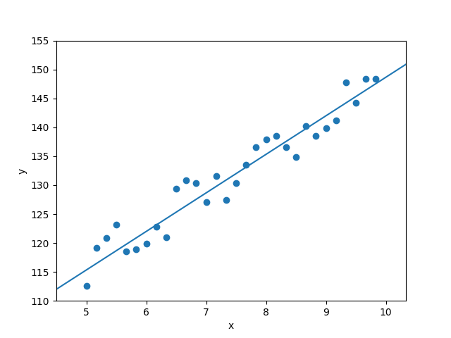
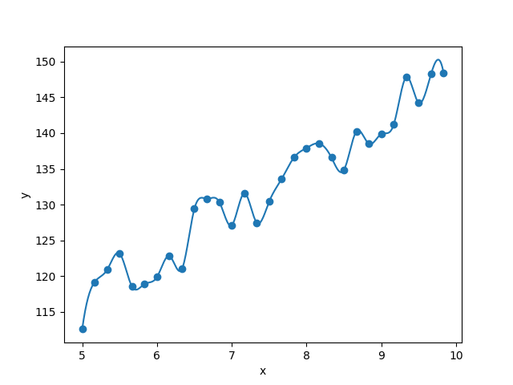
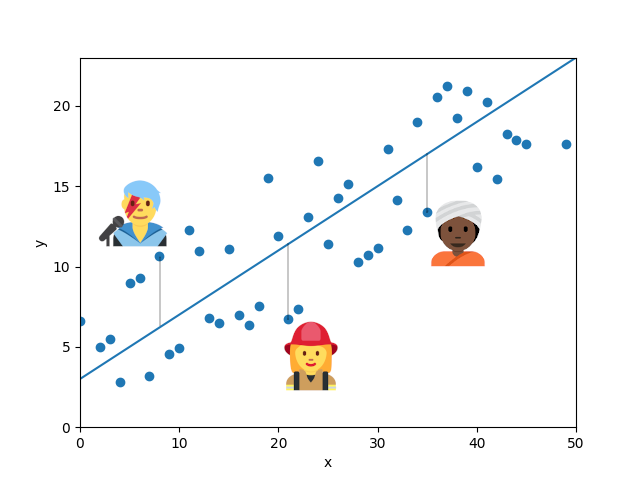

There are currently a lot of discussions on social media about the ethics of AI algorithms, with a specific focus on Large Neural Models (LNMs) such as [GPT3](https://en.wikipedia.org/wiki/GPT-3), [OPT-175B9](https://ai.facebook.com/blog/democratizing-access-to-large-scale-language-models-with-opt-175b/), [PALM](https://ai.googleblog.com/2022/04/pathways-language-model-palm-scaling-to.html) and [DALL-E](https://openai.com/dall-e-2/), to name just a few. One particular debate focuses on the harmful biases displayed by Machine Learning (ML) systems, which are known to regularly engage in a range of blatantly sexist, racist and ablist behaviours. [^1]

Many such biases arguably come from the data those systems are trained on. If you feed a machine lots of sexist and racist content, the algorithm will naturally learn to reproduce the patterns it has observed and become just as offensive as its data. This is a rather evident point. Garbage in, garbage out.

A less obvious aspect of this debate is the role played by ML models themselves in learning, reproducing and spreading wrong and harmful beliefs. So this blog entry focuses on algorithms, coming back to the most basic feature of machine learning models: the ability to generalize. In the course of inspecting the problems with AI, we will also highlight how some harmful aspects of generalization are in fact also found in human cognition, and how humans collectively deal with them. We will finally ask what it would take for ML systems to implement the kind of ethical solutions that humans have developed in the course of their evolution. The final claim is that such solutions are not implementable unless models a) acquire dynamic behaviour; b) learn to model symbolic structures; c) are trained to be *small*.
 

### Models for non-techies

For non-techie folks, a ML model is basically a mathematical function. Here is one of the simplest models you can learn: the equation of a line in a two-dimensional space. You can imagine the space as describing two specific aspects of people, for instance, age (on the x-axis) and height (on the y-axis). The graph on the left below shows some data for children aged 5-18.

<table>
<td></td>
<td></td>
</table>

The special thing about the line on the graph is that it approximates the way the *x* and *y* values of the underlying datapoints are scattered through the space. Or to put it otherwise: since the points are (roughly speaking) in a linear relationship, the most elegant way to capture this relationship is to find the equation of a line that 'fits' the points. Finding such an equation is called 'modelling' the data, and modelling the data using a line as we did above is called *linear regression*. Crucially, a model allows the system to make predictions about new, unseen data it might encounter in the future. If a new point with value *x=6.5* comes along, we can put it through our line equation to retrieve its presumed *y* value. 

Two important concepts in modelling are *error* and *overfitting*. Error refers to how far the model lies from the actual data points it approximates. Obviously, a good model will try to reduce error to a minimum. But note that fully reducing the error to 0 would mean having a model which is not a line anymore, but a complex jagged curve, as shown on the right of the above figure.

No need to say, this 'jagged' model is not only complex (i.e. its equation has many more parameters than a line), but it also fails to capture the general trend of the data. It follows the points so tightly that  when presented with an unseen *x* value, it is unlikely to be able to predict *y* in a proper way. This is called 'overfitting'.

Extreme overfitting looks very much like memorizing. Imagine knowing by heart the ages and heights of a large group of children but at the same time, lacking the ability to infer that when a child grows older, they also grow taller. This is in essence what an overfitting model does. And it is not very clever. So any ML practitioner will tell you that an essential aspect of a computational model is its ability to *generalize* over the data. That is, build a hypothesis about systematic relations in the data.

### The problem with generalization

When it comes to ethics, the wonderful skill of generalization can unfortunately be harmful. The point is that most of us are anomalies with respect to some average. Imagine that a model's training data are points describing people with respect to properties like age and height. Then the distance between those training points and the approximating function, i.e. the error of the model, tells us how much information about each individual is lost when generalizing over the population's trend. This effect has been shown to amplify biases contained in the training data itself: if an image corpus tends to show more women than men cooking, say, with a 70%/30% split, an image captioning model trained on the data will reinforce the effect and wrongly tag 85% of people cooking as women. 

Sometimes, the loss of individuality does not matter, but sometimes it does. For instance, let's have a linear model that predicts a child's height from their age and is tasked to automatically assign school uniforms to each individual. A child who happens to be particularly small, or particularly tall, for their age may not get a properly sized uniform. 

The age-height example is of course extremely simplistic. But think of real ML systems, like the ones that power Web search, recommendation systems, or even legal and medical applications. When it comes to your legal status or your health, you probably don't want an AI to fit you with a wrongly sized decision.

Per se, of course, generalization is not a bad thing. Without generalization, no learning would happen. And in fact, humans -- just like machines -- generalize over their experiences to make decisions. Interestingly, though, human generalization itself is not without its problems. Philosophers and cognitive scientists have shown how linguistic constructs like generics end up being construed as universals, thereby providing a tool for harmful biases.[^2] Even innocent statements such as *ducks lay eggs* tend to be erroneously interpreted as universals (*all ducks lay eggs*) by adult speakers.[^3] This tendency becomes particularly dangerous when it comes to the interpretation of sentences such as *Women like cooking* or *Foreigners are lazy*. The over-estimation of generic quantification is like saying that *all* individuals with a value of, say, 0.7 on the x-axis of our people space, should be reduced to the y-value indicated by our learned F function. If you have turned 9 today, regardless of who you are, you should be 138cm tall. Similarly, if you are a woman, any woman, you score highly on the *cooking* axis. 

If human cognition is as flawed as machine learning, it might be argued that there is nothing to be done about model bias. A trained model is no better and no worse than human behaviour, and removing its generalization capabilities would render it useless. So perhaps, we should stick to the tools we have and just apply firefighting to the model when something goes wrong. This is in essence what 'debiasing' proposals are about.

Except that there are fundamental differences between humans and ML models. 

### The difference between humans and machines

Assuming that every human on this planet is a universal function approximator, we have around 8 billion such functions, all generalizing -- and admittedly even over-generalizing over reality -- but crucially, all slightly different. In contrast, we only have a handful of GPT3, DALL-E, PALM, etc. Only one instance is ever deployed in real-life applications and it becomes the ground truth, as well as single point of failure, for the millions of decisions it is required to make.

Why does this matter?

Human decisions are not generated by the single generalization function of a unique individual. Or if they are, we call them 'autocratic' and regard them as fundamentally flawed. We have the intuition that good human decisions are those taken as the result of coming together and pitching our beliefs (i.e. the output of our generalizations) against each other. This is called politics. The reason why it works out well is that, unlike Large Neural Models, we are not pretrained. Our functions are dynamic and have the potential to redraw themselves with every interaction we have. The outcome of an argument with a friend, or of a parliamentary debate, is a set of updated generalization functions which, if the process has gone well, have come a little closer to each other. The good thing about this setup is that, even when the debate fails to bring people together, there is a good chance that a given individual -- even one in the minority -- will find *someone* with a generalization function that properly encodes their specific take on reality. In other words, most of us find a friend to hear them out. GPT3, DALL-E or PALM are not your friends. They are opportunists who shape themselves to always fit the majority, hoping to win the performance game. We all know those politicians who say whatever the majority wants to hear, just to be elected. That's what LNMs do too.

Another crucial difference between actual minds and ML models is that humans have the wonderful ability to do *both* generalization and memorization. If your partner, your children, your friends and your pets have not yet been diluted into a single polynomial curve, it is because your brain can form symbolic representations and differentiate between instances (Kim, Fido, the neighbour's mother-in-law). The symbolic faculty is an amazing tool. It allows us to remember that Kitty likes her food bowl to be cleaned every night and that Sylvester will refuse to enter the room if Fido has been sleeping on the armchair. It saved many a life in the course of our evolution, for instance by reminding our ancestors that, even though blueberry bushes are generally valuable, that particular blueberry bush is located next to a snake pit. It lets us do nifty operations, such as aggregating individuals into specific sets and reasoning over them: what do Kitty and Sylvester have in common? How about Kim's youngest daughters? Or the 9 planets of our solar system? From the point of view of ethics, symbolic representations provide us with the cognitive tools to remember that individuals are unique, and not a prediction on a curve. When we put someone on trial, we do not (or should not) judge them on the basis of their output value on some Great Function Approximator. Instead, we look at their specific history, background, motivation, and assess their actual deeds. Even data-driven systems such as case law are there to assess *to what extent* some set of individuals or events might resemble some other previous set of individuals. In short, [...]

### Desiderata for ML systems

Such considerations naturally bring about some desiderata for AI systems. Following the claim that a single implementation of a model may be more harmful than many instances collaborating with each other, we must consider what requirements must be satisfied to allow for fast model generation and updating. First, it seems model should be dynamic rather than pretrained. And I don't mean here 'dynamic' in the sense of 'personalizable'. There is a huge literature on personalization, which fails ethical concerns in obvious ways. First, personalization takes the shape of some meta decision function learned, again, by a single system. No need to say, learning that function requires gathering huge amounts of data in a centralized location, especially from the minorities the system is supposed to serve, prompting all sorts of privacy concerns. Second, and more subtly, there is a difference between the ability to tell people what they want to hear and actually revising one's beliefs. A pretrained model with a trainable module for personalization remains just what it is: a static aggregate of majority opinions, most likely sexist, racist and ablist.

The other desideratum for AI systems is related to size. And it is not, as ML practitioners often imply, scalability. But the entire opposite. Compactness. A model that requires 100,000 CPUs and 500 GPUs to train cannot be properly dynamic. It is well-known that giant organizations, administrations or infrastructures are inflexible and slow to implement change. It is the same for large architectures: it is costly to update them. Similarly, huge models are not suited to generate many trained instances based on their architecture.

Finally, we must ensure that models have good symbolic capabilities. This should not be something we hope will emerge from current architectures but something we actively foster in model development.

### But how?

The above desiderata may seem a tall order. A model that encodes logic as well as pattern-matching, that can be updated dynamically and is *as small as possible*? I imagine many an engineer will shake their head and roll their eyes.

But why not?

The human mind has a great ability which allows it to contain the sheer size of its symbolic memories: forgetting. I haven't yet seen any work implementing forgetting in symbolic NLP systems, but I think it would be a great addition to the literature. [...] So why not?

We just have to want it.

[^1]: [On the Dangers of Stochastic Parrots: Can Language Models Be Too Big? 🦜 ](https://dl.acm.org/doi/10.1145/3442188.3445922)
[^2]: [The original sin of cognition: Fear, prejudice, and generalization](https://www.princeton.edu/~sjleslie/The%20original%20sin%20of%20cognition%20upd010518.pdf)
[^3]: [Do all ducks lay eggs? The generic overgeneralization effect](https://www.sciencedirect.com/science/article/abs/pii/S0749596X10001154)
