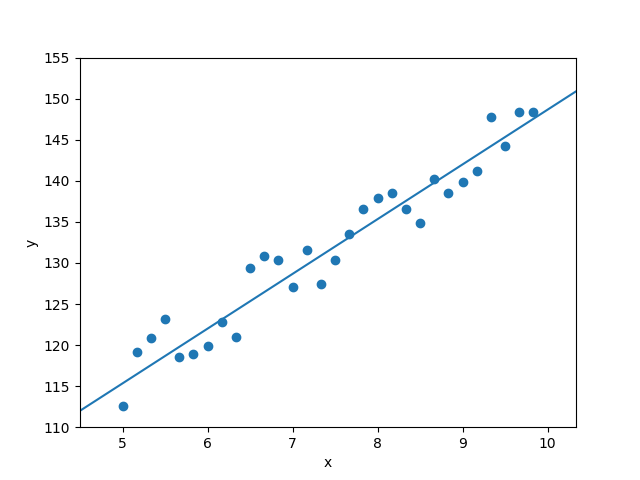
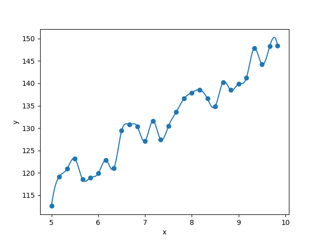
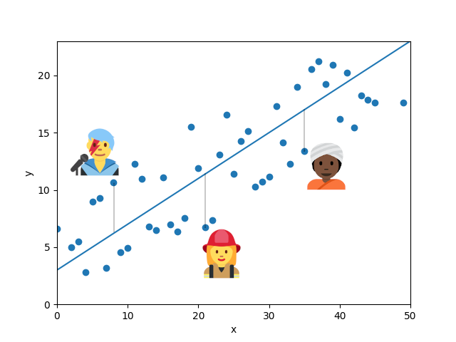

There are currently a lot of discussions on social media about the ethics of AI algorithms, with a specific focus on Large Neural Models (LNMs) such as [ChatGPT](https://openai.com/blog/chatgpt), [LLaMA](https://ai.facebook.com/blog/large-language-model-llama-meta-ai/), [BARD](https://blog.google/technology/ai/bard-google-ai-search-updates/) and [DALL-E](https://openai.com/dall-e-2/), to name just a few. One particular debate focuses on the harmful biases displayed by Machine Learning (ML) systems, which are known to regularly engage in a range of blatantly sexist, racist and ableist behaviours. [^1]

Many such biases arguably come from the data those systems are trained on. If you feed a machine lots of sexist and racist content, the algorithm will naturally learn to reproduce the patterns it has observed and become just as offensive as its data. This is a rather evident point. Garbage in, garbage out.

A less obvious aspect of this debate is the role played by ML models themselves in learning, reproducing and spreading wrong and harmful beliefs. So this blog entry focuses on algorithms, coming back to the most basic feature of machine learning models: the ability to generalize. 
 

### Models for non-techies

I will start with a very brief explanation of modelling. Folks who are already familiar with the terms 'regression', 'error' and 'overfitting' can skip to the next section. 

A machine learning model is basically a mathematical function. Large Neural Models implement extremely complex functions, but they do so using the same fundamental mechanisms as much simpler algorithms. So it is worth understanding those mechanisms.

One of the simplest models you can learn is the equation of a line in a two-dimensional space. You can imagine the space as describing two specific aspects of people, for instance, age (on the x-axis) and height (on the y-axis). The graph below shows some data for children aged 5-10, where each point represents a particular child, with their age and height. It highlights that, as a child becomes older, they also grow taller.

The special thing about the line on the graph is that it approximates the way the *x* and *y* values of the underlying datapoints are scattered across the space. Or to put it otherwise: since the points are (roughly speaking) in a linear relationship, the most elegant way to capture this relationship is to find the equation of a line that 'fits' the points. Finding such an equation is called 'modelling' the data, and modelling the data using a line as we did above is called *linear regression*. For our example, our regression tells us, roughly, how much a child grows per year of life. And the model also allows us to make predictions about new, unseen data we might encounter in the future. If a new point with value *x=6.5* comes along, we can put it through our line equation to retrieve its presumed *y* value. 

Two important concepts in modelling are *error* and *overfitting*. Error refers to how far the model lies from the actual data points it approximates. Say the line of our model predicts that a 7-year-old child is 127cm tall, but we have an actual example of a child of that age, who comes to 125cm only. In that case, the model has an error of 2cm.

Obviously, a good model will try to reduce error to a minimum. But note that fully reducing the error to 0, i.e. drawing a function that passes exactly through our observed data, would mean having a model which is not a line anymore, but a complex jagged curve, as shown below. 

No need to say, this 'jagged' model is not only complex (i.e. its equation has many more parameters than a line), but it also fails to capture the general trend of the data. It follows the points so tightly that  when presented with an unseen *x* value, it is unlikely to be able to predict *y* in a proper way. This is called 'overfitting'.

### The problem with generalization

Extreme overfitting looks very much like memorizing. Imagine knowing by heart the ages and heights of a large group of children but at the same time, lacking the ability to infer that when a child grows older, they also grow taller. This is in essence what an overfitting model does. And it is not very clever. So any ML practitioner will tell you that an essential aspect of a computational model is its ability to *generalize* over the data. That is, build a hypothesis about systematic relations in our observations.

When it comes to ethics, the wonderful skill of generalization can unfortunately be harmful. The point is that most of us are anomalies with respect to some average. Imagine that a model's training data are points describing people with respect to properties like age and height. Then the distance between those training points and the approximating function, i.e. the error of the model, tells us how much information about each individual is lost when generalizing over the population's trend. This effect has been shown to amplify biases contained in the training data itself: if an image corpus tends to show more women than men cooking, say, with a 66%/33% split, an image captioning model trained on the data will reinforce the effect and may wrongly tag 84% of people cooking as women.[^2] 

Look at the hypothetical model below. The folks I have highlighted happen to be particularly far from the regression line, compared to other points. But of course, that doesn't make them less real. They are people who exist out there in the world and embody one the many ways that one can be human.

It is important to be aware of the loss of individuality inbuilt in generalization, in particular when we ask systems to make decisions for us. For instance, let's have a linear model that predicts a child's height from their age and is tasked to automatically assign school uniforms to each individual. A child who happens to be particularly small, or particularly tall, for their age may not get a properly sized uniform. 

The age-height example is of course extremely simplistic. But think of real ML systems, like the ones that power Web search, recommendation systems, or even legal and medical applications. When it comes to your legal status or your health, you definitely don't want an AI to fit you with a wrongly sized decision.

Per se, of course, generalization is not a bad thing. Without generalization, no learning would happen. And in fact, humans -- just like machines -- generalize over their experiences to make decisions. Without this ability, we would be unable to make the thousands of small, unconscious predictions that carry us through our everyday life.

Interestingly, though, human generalization itself is not without its problems. Philosophers and cognitive scientists have shown how linguistic constructs like generics end up being construed as universals, thereby providing a tool for harmful biases.[^3] Even innocent statements such as *ducks lay eggs* tend to be erroneously interpreted as universals (*all ducks lay eggs*) by adult speakers.[^4] This tendency becomes particularly dangerous when it comes to the interpretation of sentences such as *Women like cooking*. The over-estimation of generic quantification is like saying that *all* individuals with a value of, say, 0.7 on the x-axis of our people space, should be reduced to the y-value indicated by our learned model. If you have turned 9 today, regardless of who you are, you should be 138cm tall. Similarly, if you are a woman, any woman, you score highly on the *cooking* axis. 

If human cognition is as flawed as machine learning, it might be argued that there is nothing to be done about model bias. A trained model is no better and no worse than human behaviour, and removing its generalization capabilities would render it useless. So perhaps, we should stick to the tools we have and just apply firefighting to the model when something goes really wrong. This is what we have seen happening over and over again with recent AI models. The current ChatGPT, for instance, is a sibling of the InstructGPT model, a system that underwent a considerable amount of human-driven re-training to weed out biases and false statements in its output.

Except that firefighting is just that. Firefighting. Not mentioning the fact that the type of fixes applied by leading AI companies involves grueling annotation processes by humans. OpenAI was recently in the news for subcontracting poorly paid Kenyan workers who were asked to label disturbing content ranging from sexual abuse to hate speech, with little access to psychological help.[^5] It would be hard to argue  that the company is displaying responsible, ethical behaviour.

So what if, instead, we remembered the fundamental differences between humans and ML models, and take a page out of the human book?

### The difference between humans and machines

Neural networks are sometimes called 'universal function approximators'. This refers to the fact that they can in principle learn any function that properly generalizes over some training data: lines, polynomials, anything. Arguably, every human on this planet is also a universal function approximator: our species is good at prediction, and can perform inference over many types of different problems. So we have around 8 billion such approximators, all generalizing -- and admittedly even over-generalizing over reality. But crucially, *all slightly different*. In contrast, we only have a handful of ChatGPT, DALL-E, LLaMA, etc. Only one instance is ever deployed in real-life applications and it becomes the ground truth, as well as single point of failure, for the millions of decisions it is required to make.

Why does this matter?

Human decisions are not generated by the single generalization function of a unique individual. Or if they are, we call them 'autocratic' and regard them as fundamentally flawed. We have the intuition that good human decisions are those taken as the result of coming together and pitching our beliefs (i.e. the output of our generalizations) against each other. This is called politics. The reason why it works out well is that, unlike Large Neural Models, we are not pretrained. Our functions are dynamic and have the potential to redraw themselves with every interaction we have. The outcome of an argument with a friend, or of a parliamentary debate, is a set of updated generalization functions which, if the process has gone well, have come a little closer to each other. The good thing about this setup is that, even when the debate fails to bring people together, there is a good chance that a given individual -- even one in the minority -- will find *someone* with a generalization function that properly encodes their specific take on reality. In other words, most of us find a friend to hear them out. ChatGPT, DALL-E or LLaMA are not your friends. They are opportunists who shape themselves to always fit the majority, hoping to win the performance game. We all know those politicians who say whatever the majority wants to hear, just to be elected. That's what LNMs do.

Another crucial difference between actual minds and ML models is that humans have the wonderful ability to do *both* generalization and memorization. If your partner, your children, your friends and your pets have not yet been diluted into a single polynomial curve, it is because your brain can form symbolic representations and differentiate between instances (Kim, Fido, the neighbour's mother-in-law). The symbolic faculty is an amazing tool. It allows us to remember that Kitty likes her food bowl to be cleaned every night and that Sylvester will refuse to enter the room if Fido has been sleeping on the armchair. It saved many a life in the course of our evolution, for instance by reminding our ancestors that, even though blueberry bushes are generally valuable, that particular blueberry bush is located next to a snake pit. It lets us do nifty operations, such as aggregating individuals into specific sets and reasoning over them: what do Kitty and Sylvester have in common? How about Kim's youngest daughters? Or the planets of our solar system? From the point of view of ethics, symbolic representations provide us with the cognitive tools to remember that individuals are unique, and not a prediction on a curve. When we put someone on trial, we do not (or should not) judge them on the basis of their output value on some Great Function Approximator. Instead, we look at their specific history, background, motivation, and assess their actual deeds. Even data-driven systems such as case law are there to assess *to what extent* some set of individuals or events might resemble some other previous set of individuals.

This is where meaning comes in. In linguistics, meaning is a formal notion which refers to the glue between the words and sentences of our natural languages and a state-of-affairs in a world (the real one or a fictional one). It allows us to utter the word *cat* and thereby make our interlocutor understand that we are talking about a furry creature out there in reality, or in the movie we are currently watching.

Now, note that an English speaker does not normally use the word *cat* on its own. Instead, they say *the cat*, *three cats*, *some cats*, *all cats*, *cats*. That is, they *quantify* over cats. Your own mother tongue may do this differently from English, but it doesn't matter. The point is that natural languages give us the ability to talk about things, individually (*the cat*), in groups (*some cats*) and generically (*cats*). They let us move seamlessly from the symbolic (a point on a graph) to the generalization (a regression line), using a single linguistic function: quantification. A theoretical approach to quantification was introduced in 1973 by logician Richard Montague in the paper "The Proper Treatment of Quantifiers in Ordinary English", famously known among linguists as PTQ.[^6] The theory has been considerably expanded over the years by the linguistic community, giving us powerful ways to formalize the quantification mechanism using tools of mathematical logic.

In a separate paper, Montague also introduced the idea that the formal mechanisms of meaning could be operated from 'points of reference', i.e. from the point of view of a particular speaker in a particular space-time context.[^7] It is in essence a very simple idea. It just says that when you and I utter *the cat*, we may well be talking about a different cat, for instance because you are in Nairobi and I am in Rome and we are pointing at two different cats. By extension, whenever you and I utter *cats* -- the generalization over individual instances of cats --, we may well have different regression lines in mind. Your prototypical cat may have lighter fur than mine, or shorter hair, or may spend more time outdoors. 

So there is a 50-year old theory of meaning which gives us a helpful starting point to reconcile the way we think of individuals with the way we *generalize* over them. Bonus: it also allows us to represent this mechanisms over many minds, accounting for the differences in beliefs and points of view which make human debates so precious.

Why is it not implemented in AI systems? Can we change this?

### Desiderata for ML systems

The above considerations naturally bring about some technical desiderata for AI systems. If we accept the claim that a single implementation of a model may be more harmful than many instances collaborating with each other, if we understand the importance of meaning representations in decision systems, we must consider what requirements must be satisfied to bring them about. 

First, models should be dynamic rather than static. And I don't mean here 'dynamic' in the sense of 'personalizable'. There is a huge literature on personalization, which fails ethical concerns in obvious ways.[^8] I also don't refer to the practice of 'fine-tuning', which takes an existing model and adapts it to a task or domain in the confines of a lab. I mean proper, online belief update, the way humans do it when they talk to each other.

The other desideratum for AI systems is related to size. And it is not, as ML practitioners often imply, scalability. But the entire opposite. Compactness. A model that requires 100,000 CPUs and 500 GPUs to train cannot be properly dynamic. It is well-known that giant organizations, administrations or infrastructures are inflexible and slow to implement change. It is the same for large architectures: it is costly to update them. We have see recent progress on 'pruning' giant neural networks to reduce their size, post-hoc, once they have been trained at scale.[^9] But this is not enough. If we want to churn out populations of artificial speakers, and thereby ensure diversity, we need to be able to train small in the first place. 

Finally, and perhaps most crucially, we must ensure that models have good symbolic capabilities. This should not be something we hope will emerge from current architectures but something we actively foster in model development.

The above desiderata may seem a tall order. A model that properly encodes meaning as well as pattern processing abilities, that can be updated dynamically and is *as small as possible*?

Why not?

The last years have seen enormous amounts of funding directed towards one specific type of machine learning model. One. Imagine what might have happened if all that funding (and time and energy) had been put into the investigation of diverse algorithms. By now, we would have a much better understanding of the range of techniques and options available to model intelligent behaviour. As developers, we would have a fuller toolbox. As consumers, we would have choices. But instead we got caught up in very successful marketing campaigns that somehow convinced a lot of us that AI *is* ChatGPT, or BARD, or LLaMA. It is time to move away from a fake necessity and think again of possibilities.

Human-friendly AI is possible. But we have to want it.

[^1]: Bender, E. M., Gebru, T., McMillan-Major, A., & Shmitchell, S. (2021). [On the Dangers of Stochastic Parrots: Can Language Models Be Too Big? 🦜 ](https://dl.acm.org/doi/10.1145/3442188.3445922) In Proceedings of the 2021 ACM conference on fairness, accountability, and transparency (pp. 610-623).
[^2]: Zhao, J., Wang, T., Yatskar, M., Ordonez, V., & Chang, K. W. (2017). [Men Also Like Shopping: Reducing Gender Bias Amplification using Corpus-level Constraints](https://aclanthology.org/D17-1323.pdf) In Proceedings of the 2017 Conference on Empirical Methods in Natural Language Processing (pp. 2979-2989).
[^3]: Leslie, S. J. (2017). [The original sin of cognition: Fear, prejudice, and generalization](https://www.princeton.edu/~sjleslie/The%20original%20sin%20of%20cognition%20upd010518.pdf) The Journal of Philosophy, 114(8), 393-421.
[^4]: Leslie, S. J., Khemlani, S., & Glucksberg, S. (2011). [Do all ducks lay eggs? The generic overgeneralization effect](https://www.sciencedirect.com/science/article/abs/pii/S0749596X10001154) Journal of Memory and Language, 65(1), 15-31.
[^5]: [OpenAI Used Kenyan Workers on Less Than $2 Per Hour to Make ChatGPT Less Toxic](https://time.com/6247678/openai-chatgpt-kenya-workers/)
[^6]: Montague, R. (1973). [The proper treatment of quantification in ordinary English](https://web.archive.org/web/20110523023924id_/http://www.cs.rhul.ac.uk/~zhaohui/montague73.pdf). In Approaches to natural language: Proceedings of the 1970 Stanford workshop on grammar and semantics (pp. 221-242). Springer Netherlands.
[^7]: Montague, R. (1970). [Pragmatics and intensional logic](https://link.springer.com/content/pdf/10.1007/BF00413599.pdf). Synthese, 22(1-2), 68-94.
[^8]: Personalization takes the shape of some meta decision function learned, again, by a single system. No need to say, learning that function requires gathering huge amounts of data in a centralized location, especially from the minorities the system is supposed to serve, prompting all sorts of privacy concerns. Second, and more subtly, there is a difference between the ability to tell people what they want to hear and actually revising one's beliefs.
[^9]: Liang, T., Glossner, J., Wang, L., Shi, S., & Zhang, X. (2021). Pruning and quantization for deep neural network acceleration: A survey. Neurocomputing, 461, 370-403. [Pruning and Quantization for Deep Neural Network Acceleration: A Survey](https://arxiv.org/pdf/2101.09671.pdf).
